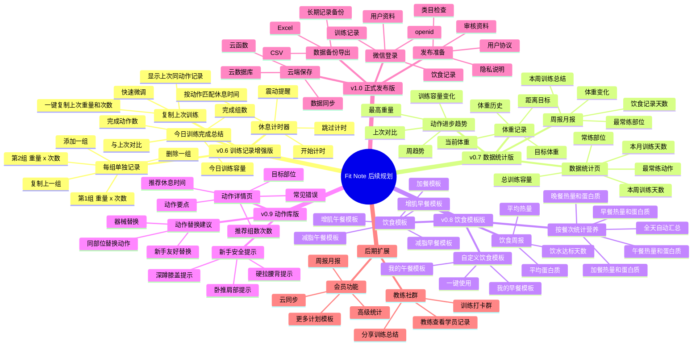

# Fit Note 后续规划思路图

> 用途：后续版本规划、功能取舍、迭代讨论。  
> 当前版本：`v0.9.1 本地稳定版`

## 一、思路图 Mermaid 版

如果你的 Markdown 工具支持 Mermaid，可以直接预览下面的思路图。



---

## 二、可编辑文字版

### v0.6：训练记录增强版，优先级最高

目标：让用户在健身房里更顺手地记录训练。

- 每组单独记录
  - 第 1 组：重量 × 次数
  - 第 2 组：重量 × 次数
  - 添加一组
  - 删除一组
  - 复制上一组
- 复制上次训练
  - 显示上次同动作记录
  - 一键复制上次重量和次数
  - 支持快速微调
- 今日训练完成总结
  - 完成动作数
  - 完成组数
  - 今日训练容量
  - 与上次训练对比
- 休息计时器
  - 根据动作自动匹配休息时间
  - 开始计时
  - 跳过计时
  - 震动提醒

---

### v0.7：动作库版，已实现

目标：让新手知道动作怎么练，并能在计划和记录中随时查看动作要点。

- 动作库页
  - 胸部、背部、腿臀、肩部、手臂、核心、有氧分类
  - 支持按动作名或部位搜索
  - 展示动作目标、器械和难度
- 动作详情页
  - 动作介绍
  - 主要训练目标
  - 动作图解区域
  - 无图时显示图解待补充
  - 视频展示能力预留
  - 动作步骤
  - 训练要点
  - 常见错误
  - 新手建议
- 页面联动入口
  - 首页快捷入口
  - 今日训练动作详情
  - 计划页动作详情
  - 训练记录动作详情
- 一键记录
  - 从动作详情直接带入训练记录页

---

### v0.8：饮食模板版

目标：让用户更快完成饮食记录。

- 饮食模板
  - 增肌早餐模板
  - 增肌午餐模板
  - 减脂早餐模板
  - 减脂午餐模板
  - 加餐模板
- 自定义饮食模板
  - 我的早餐模板
  - 我的午餐模板
  - 一键使用
- 按餐次统计营养
  - 早餐热量和蛋白质
  - 午餐热量和蛋白质
  - 晚餐热量和蛋白质
  - 加餐热量和蛋白质
  - 全天自动汇总
- 饮食周报
  - 平均热量
  - 平均蛋白质
  - 饮水达标天数

---

### v0.9：本地稳定版，已实现

目标：先用本地缓存完成 MVP 验证，降低成本，保证小程序稳定运行。

- 本地缓存
  - 用户资料本地保存
  - 训练记录本地保存
  - 饮食记录本地保存
  - 训练计划本地保存
  - 今日打卡本地保存
- 稳定体验
  - 关闭运行中的云同步请求
  - 避免未开通云开发时出现报错
  - “我的”页展示本地数据管理说明
- 后端规划
  - 保留 `cloudfunctions/` 目录
  - 保留 `login`、`syncUserData`、`getStats`、`exportRecords` 等后续规划
  - 后续有预算后再接入 CloudBase 或自建后端

---

### v1.0：正式发布版

目标：准备真实上线和长期使用。

- 云端保存
  - 云数据库
  - 云函数
  - 多设备同步
- 微信登录
  - openid
  - 用户资料
  - 训练记录
  - 饮食记录
- 数据备份导出
  - CSV
  - Excel
  - 长期记录备份
- 发布准备
  - 隐私说明
  - 用户协议
  - 审核资料
  - 类目检查

---

### 后期扩展

不建议现在做，适合产品稳定后再考虑。

- 会员功能
  - 高级统计
  - 更多计划模板
  - 云同步
  - 周报月报
- 教练/社群功能
  - 教练查看学员记录
  - 训练打卡群
  - 分享训练总结

---

## 三、推荐执行顺序

```text
v0.6 训练记录增强版
→ v0.7 动作库 + 动作详情
→ v0.8 CloudBase 初始化尝试
→ v0.9.1 本地稳定版
→ v1.0 数据统计增强 + 本地导出 + 发布准备
→ 后续云端版：CloudBase 或自建后端
```

## 四、下一步最推荐做

```text
v1.0：完善数据统计、本地数据导出、体重趋势和正式发布审核准备
```
